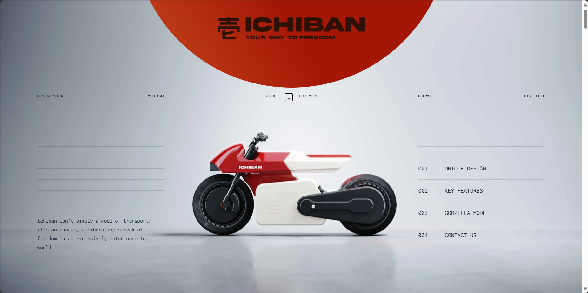

# Clone Ichiban.bike 🏍️

A clone of [Ichiban.bike](https://www.ichiban.bike/) developed with the [Astro](https://astro.build/) meta-framework. This project was created for learning and practice purposes, focusing on smooth scroll animations and stylized visual effects.



## 🎯 Project Objective

This project is a reproduction of the Ichiban.bike website, designed for desktop version only. The focus was on:
- Implementation of smooth scroll animations
- Frame-by-frame animation of a futuristic Japanese motorcycle
- Image and overall site performance optimization compared to the original version
- Utilizing Astro's features
- Faithful reproduction of the original design

## 🛠️ Technologies Used

- Astro v5.1.3
- astro-cloudinary for image management
- Native CSS for styling

## 🚀 Performance Optimization

This clone emphasizes performance optimization, with a methodical approach to asset management:

### Image Optimization
- Conversion of all images to WebP format via Squoosh.app
- Replacement of original site's base64 images with optimized WebP files
- Use of Astro's `Image` component for automatic optimization:
  - Lazy loading
  - Automatic resizing
  - Modern format optimization (WebP)
  - Automatic srcset generation

### Technical Choices
- Use of CSS `background-image` for frame-by-frame animation
  - Better GPU hardware acceleration
  - Reduced JavaScript load
  - Enhanced animation rendering performance

### Performance Comparison Results

| Metric | Clone (Cold Start) | Clone (Hot Start) | Original (Cold Start) | Original (Hot Start) |
|----------|-------------------|------------------|---------------------|-------------------|
| Total Size | 13.3 MB | 8.5 MB | 48.6 MB | 41.5 MB |
| Load Time | 8.59s | 893ms | 3.81s | 2.31s |
| First Paint | 1.69s | 859ms | 1.59s | 1.47s |
| DOMContentLoaded | 301ms | 261ms | 3.7s | 1.23s |

### 📊 Detailed Metrics Analysis

1. **Total Load Time**
   - Represents the time needed to load all page resources
   - Includes: HTML, CSS, JavaScript, images, fonts, and other assets
   - Higher cold start time (8.59s) explained by:
     - Initial loading of animation frames (motorcycle sequence)
     - Browser cache creation for static assets
     - JavaScript parse and execution time

2. **DOMContentLoaded**
   - When initial HTML is completely loaded and parsed
   - Synchronous scripts are executed
   - Doesn't include async resources (images, animation frames)
   - Performance: 301ms vs 3.7s (original)
   - Improvement achieved through:
     - Elimination of blocking scripts
     - Critical HTML optimization
     - Deferred loading strategy

3. **First Paint**
   - First visual display for the user
   - Slightly slower than original (1.69s vs 1.59s)
   - Acceptable trade-off for better overall experience

4. **Size Optimization**
   - Drastic 72% reduction (13.3 MB vs 48.6 MB)
   - Breakdown of gains:
     - WebP images: ~60% reduction
     - Base64 elimination: ~25% reduction

### 🔄 Hot vs Cold Start Analysis

**Cold Start (First Load)**
- Empty cache
- Complete resource download
- Browser cache creation
- Initial JavaScript compilation

**Hot Start (Subsequent Loads)**
- Browser cache utilization
- Significant Load Time reduction (893ms vs 8.59s)
- 89% loading time improvement
- Benefits of Astro's caching strategy

## 🚀 Installation and Setup
Install dependencies
```bash
pnpm install
```

Start development server
```bash
pnpm dev
```

Build the site
```bash
pnpm build
```

Preview production version
```bash
pnpm preview
```

## ⚠️ Limitations

- Site optimized for desktop version only (No responsive version)
- Educational project only

## 🎨 Credits

This project is a clone developed for educational purposes, inspired by [Ichiban.bike](https://www.ichiban.bike/). All original design rights belong to their respective owners.

## 📝 Note

This project is an unofficial reproduction created for learning purposes and should not be used for commercial purposes.